# prj301-se1753-08
## Team: PrayGodNoBug (PGNB)

- [prj301-se1753-08](#prj301-se1753-08)
  - [Team: PrayGodNoBug (PGNB)](#team-praygodnobug-pgnb)
  - [Introduction](#introduction)
  - [Features](#features)
      - [1. For ordinary users](#1-for-ordinary-users)
      - [2. For shop owner:](#2-for-shop-owner)
  - [Sitemap- prj301-se1753-08](#sitemap--prj301-se1753-08)
  - [Wireframe](#wireframe)
    - [1.Home](#1home)
    - [2.Login](#2login)
    - [3.Register](#3register)
    - [4.User Profile](#4user-profile)
    - [5.User Profile Editor](#5user-profile-editor)
    - [6.BMR Calculator](#6bmr-calculator)
    - [7.Weekly Menu](#7weekly-menu)
    - [8.Product List](#8product-list)
    - [9.Product Detail](#9product-detail)
    - [10.Product cart](#10product-cart)
  - [Database Diagram](#database-diagram)
  - [Conclusion](#conclusion)
  - [Project improvement](#project-improvement)
  - [What have we learned through the project](#what-have-we-learned-through-the-project)

## 	Introduction
PGNB (Pray God No Bugs) introduces to you a platform that aids in designing a scientific, tailored diet that fits your nutritional demand. This web app is a final project of course PRJ301, which aims at constructing a basic, introductory, yet complete application to serve a specific purpose. Serving such targets, PGNB has created a place where you can custom your meals and find suggestions for dietary supplements, which are our products.

## Features

#### 1. For ordinary users

- Input your body indices, which include weight, height, age, activity level, number of meals and exercise sessions, …. Upon the submission, we will output your relative BMI measurement, which partially reflects your current fitness status.
-	Based upon the data above, users are prompted to input their additional parameters, such as food preference (vegan/Asian and Pacific/European and North American/…) and food avoidance ( based on allergies/religious obligations/inaccessibility/…), the desired body outcome (gain weight/lose weight/ stay the same) and the duration of the program to achieve a granular-level diet that perfectly fits their daily lifestyle.
- On the menu page, you can view the assessment of your recommended diet table, which covers primary macronutrient demands and the coverage of these requirements that your current diet can provide. This displays your main meals, snacks, and exercise sessions that users input before. Moreover, users are welcome to modify their meals by replacing the food they wish with equivalent amount.
-	Additionally, we also offer a page of summary of foods that will appear in the current week, and user can download this list in format of pdf file.
-	This feature does not require you to sign up to use, but if you wish to save your diet design, we will prompt you to the sign up page to be a part of our community, which supports your progress and the notification for new releases.
-	Upon the assessment of your diet, we will recommend dietary supplements that help compensate for the nutrient shortages or overconsumption based on the category of nutrients that you lack.
-	Shopping area:
	- We offer a shopping zone that users are free to pick according to their needs. Users can filter category, search by name, and add products to your cart.
	- Users can view details of the selected products, view their cart and the history of purchase.
    - On the detail page of the picked product, related items are also  recommended so that you can have other choices for ones of the same category.

#### 2. For shop owner:
- Admin of this page are granted with high priority. Admin can edit/add/delete/create new user, product, food, exercise inventories.
-	New features:
    - Admin can add pop-ups that shows products that he/she wants to draw   attentions.
    - Admin is also supported with sale-off campaigns, where he/she can put rollouts, gifts, … in the products detail.
    -	Admin can also email registered users of new product arrivals or new campaigns, new releases, or system update intervals.
    -	Admin will be notified of new purchases from users via registered email.
-	Admin can flag users and change their rank to VIP for better benefits. 

## Sitemap- [prj301-se1753-08](#prj301-se1753-08)
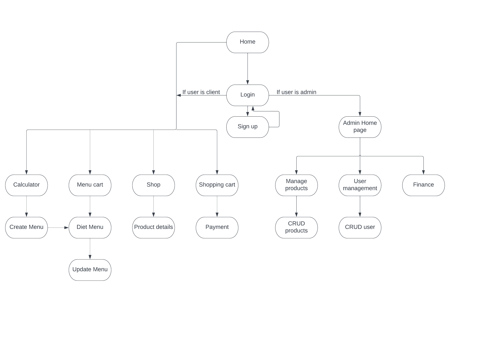

## Wireframe

### 1.Home

### 2.Login
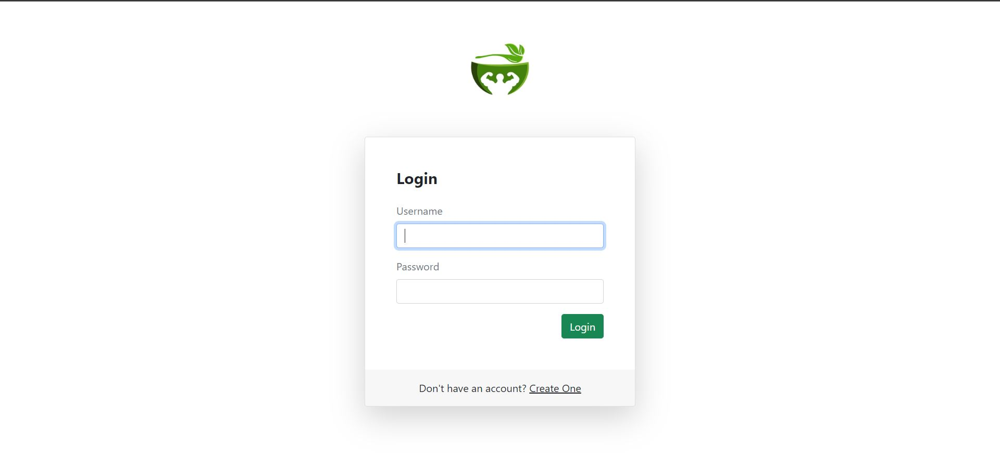
### 3.Register
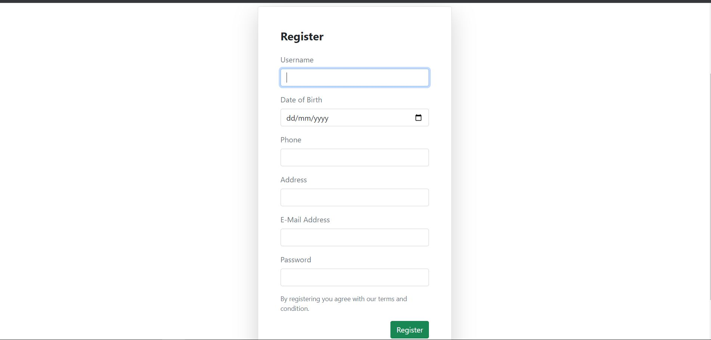
### 4.User Profile
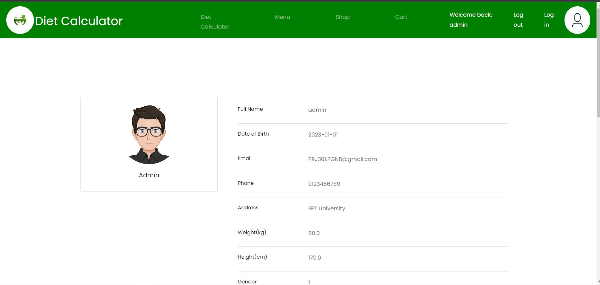
### 5.User Profile Editor
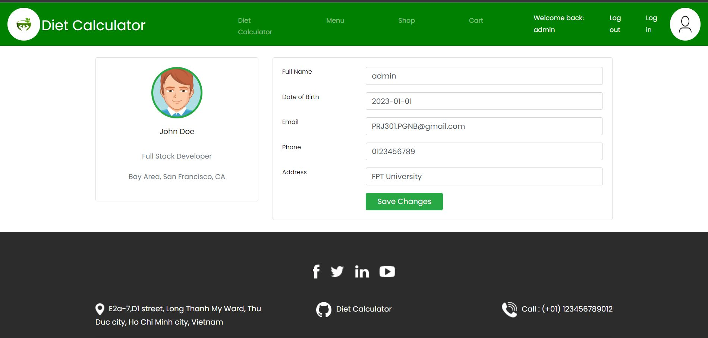
### 6.BMR Calculator
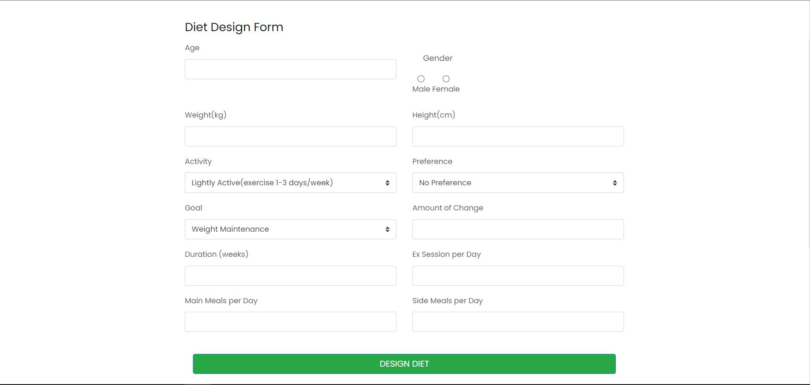
### 7.Weekly Menu
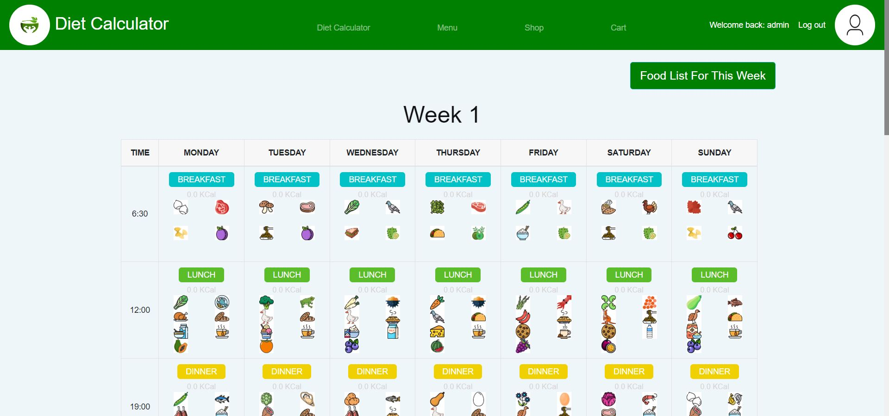
### 8.Product List
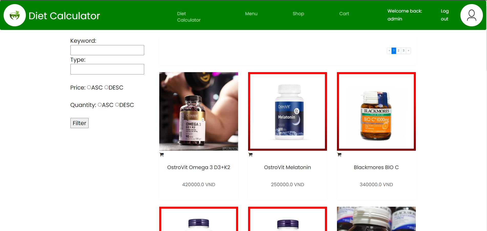
### 9.Product Detail
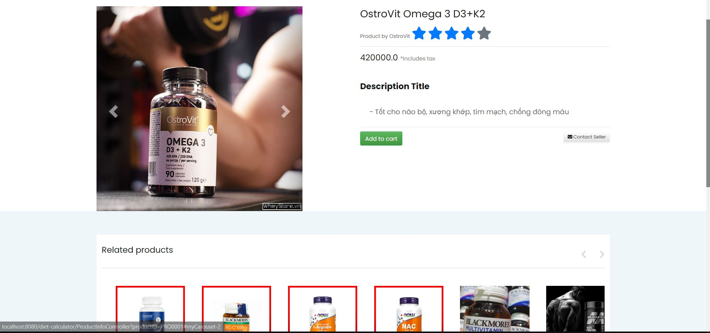
### 10.Product cart
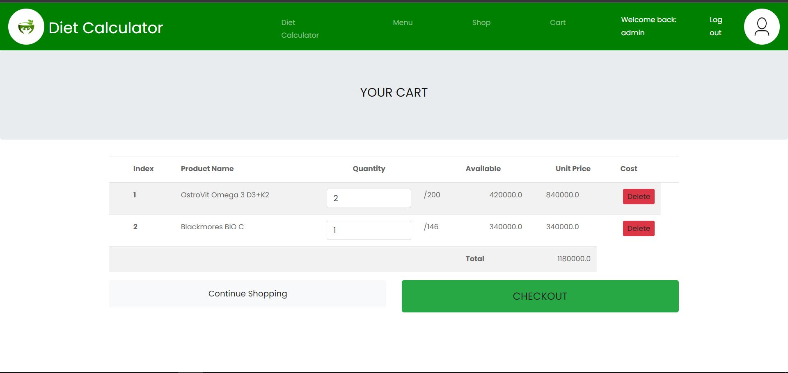

## Database Diagram

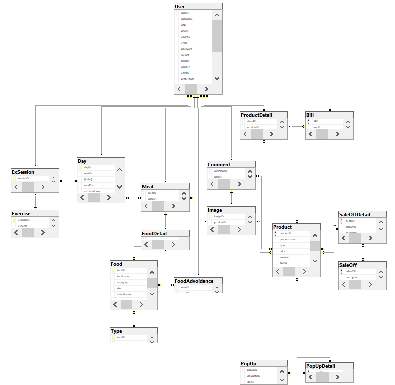

## Conclusion
-	Pros:
    -	We offer well-rounded, comprehensive services about diet and supplements for users. Besides, rich controlling features are also provided to the admin users. 
    -	Our selling points include the mailing feature, good user interface, …

-	Cons:
    -	Our team took the front-end template from multiple different sites. That leads to the CSS applying several times while the page load.
    -	While we were working in GIT, we faced a lot of conflicts. But because we didn't learn how to use GIT ourselves first, we got a hard time fixing them. 
    -	We found that we are too ambitious for planning so many features for our project. Although we end up complete about 90% of the features, but these features can be more optimal and better for customer experience if we just focus on less of them.

## Project improvement
  -	To improve the front-end: we will find a front-end THEME rather than multiple-page sources. It will make our CSS more synchronize and make our page looks better.
  -	More complete features to make the user experience better and avoid unknown bugs.
  -	Improve code clarity
  -	Apply design patterns
  -	Make some API features
  -	Try to deploy the web online
- [prj301-se1753-08](#prj301-se1753-08)
  - [Team: PrayGodNoBug (PGNB)](#team-praygodnobug-pgnb)
  - [Introduction](#introduction)
  - [Features](#features)
      - [1. For ordinary users](#1-for-ordinary-users)
      - [2. -	For shop owner:](#2--for-shop-owner)
  - [Sitemap- prj301-se1753-08](#sitemap--prj301-se1753-08)
  - [Wireframe](#wireframe)
    - [1.Home](#1home)
    - [2.Login](#2login)
    - [3.Register](#3register)
    - [4.User Profile](#4user-profile)
    - [5.User Profile Editor](#5user-profile-editor)
    - [6.BMR Calculator](#6bmr-calculator)
    - [7.Weekly Menu](#7weekly-menu)
    - [8.Product List](#8product-list)
    - [9.Product Detail](#9product-detail)
    - [10.Product cart](#10product-cart)
  - [Database Diagram](#database-diagram)
  - [Conclusion](#conclusion)
  - [Project improvement](#project-improvement)
  - [What have we learned through the project](#what-have-we-learned-through-the-project)
- [prj301-se1753-08](#prj301-se1753-08)
  - [Team: PrayGodNoBug (PGNB)](#team-praygodnobug-pgnb)
  - [Introduction](#introduction)
  - [Features](#features)
      - [1. For ordinary users](#1-for-ordinary-users)
      - [2. -	For shop owner:](#2--for-shop-owner)
  - [Sitemap- prj301-se1753-08](#sitemap--prj301-se1753-08)
  - [Wireframe](#wireframe)
    - [1.Home](#1home)
    - [2.Login](#2login)
    - [3.Register](#3register)
    - [4.User Profile](#4user-profile)
    - [5.User Profile Editor](#5user-profile-editor)
    - [6.BMR Calculator](#6bmr-calculator)
    - [7.Weekly Menu](#7weekly-menu)
    - [8.Product List](#8product-list)
    - [9.Product Detail](#9product-detail)
    - [10.Product cart](#10product-cart)
  - [Database Diagram](#database-diagram)
  - [Conclusion](#conclusion)
  - [Project improvement](#project-improvement)
  - [What have we learned through the project](#what-have-we-learned-through-the-project)

## What have we learned through the project

  -	Developing a website using: servlet, jsp, MVC2 model
  -	Git, GitHub
  -	SQL database design and query
  -	Teamwork
  -	Task and progress management

