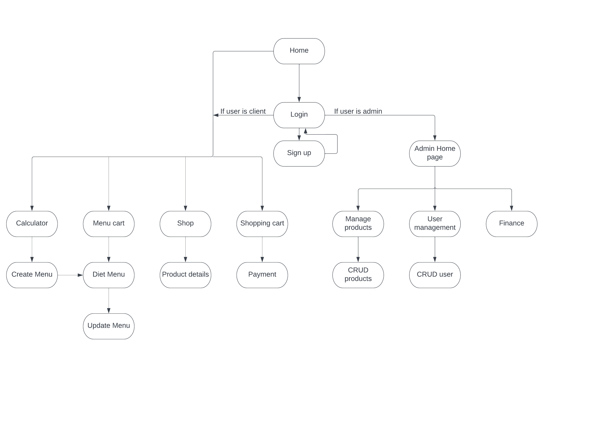

# prj301-se1753-08
## Team: PrayGodNoBug (PGNB)
## Sitemap

## Functional requirements

#### 1. Customers:

- [ ] Input their body indices (weight, height, age, gender, pregnancy, activity level) to calculate the general energy and nutrition demands, besides the BMI that reflects their current fitness status.

- [ ] Based on the data above, the users are prompted to input their food preference (vegan/Asian/plant-based/non-GMO/…) and food avoidance (allergies/religious obligations/inaccessibility/…), the desired body outcome (tang can/ giam can/ stay the same) and the duration of the program to achieve a granular-level diet that perfectly fits their daily lifestyle.

- [ ] Menu: modifiable

  - [ ] Change the food into another one with the equivalent nutritional value.

  - [ ]  Change the day of weekly menu.

  - [ ]  Physical program: 2hrs of walking day (morning exercise/ afternoon jogging/ night workout …)

  - [ ]  Update the progress after a period of time.

  - [ ]  Recommendation pop-ups for supplements below.

- [ ] Shopping area:

  - [ ]  Search bar, filter (by date, by rate of purchase, by category)

  - [ ]  Details

  - [ ]  Review + comments

  - [ ]  Select items and purchase.

  - [ ]  View history of purchases.

- [ ] Membership: users are expected to sign up for extra services: shopping, updating progress, receiving new menu releases (weekly).

- [ ] Contact with admin for more information (Zalo chat + messenger + email).

#### 2. Admins:

  - [ ] Manage the information of the website (noi sau)

  - [ ] Manage products

    - [ ] Add/delete/modify product details

    - [ ] Stock (num--)

    - [ ] Sale off

    - [ ] Pop up event

    - [ ] Best sellers (conspicuous products at the first sight)

  - [ ] Finance

      - [ ] Visit

      - [ ] Profit

      - [ ] Branches

  - [ ] User management

    - [ ] Modify user information.

    - [ ] Flag users (VIP, non-potential)

  - [ ] Send email to customers about new releases.

  - [ ] Support (message/chatbox)

## Wireframe
<iframe style="border: 1px solid rgba(0, 0, 0, 0.1);" width="800" height="450" src="https://www.figma.com/embed?embed_host=share&url=https%3A%2F%2Fwww.figma.com%2Ffile%2Fs728wrex5xnLa2Vp1Lz2Vq%2FPRJ301-GUI%3Fnode-id%3D0%253A1%26t%3DcF9J3hlVz8DrxpjW-1" allowfullscreen></iframe>